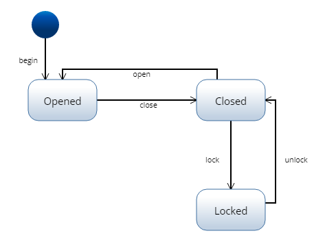
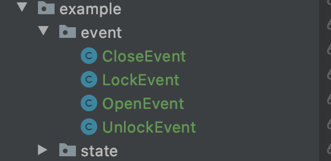
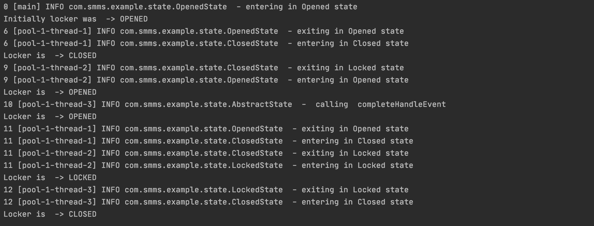

# State Machine Management System  (SMMS)

SMMS provides state management in simple and effective way, has capability of
handling events synchronously and asynchronously both.


[](https://github.com/Priytam/statemachine/blob/master/LICENSE)
[](https://travis-ci.org/Priytam/statemachine)
[](https://search.maven.org/search?q=g:com.github.priytam%20AND%20a:statemachine)

[](http://hits.dwyl.io/Priytam/statemachine)
[](https://github.com/ellerbrock/open-source-badges/)
[](https://GitHub.com/Naereen/StrapDown.js/graphs/commit-activity)

## Purpose
*To write a state machine system in easy and effective way*

If your system requires managing complex states like below consider this tool as your life saver
<div>
    
    
    
</div>


## Table of Contents

  1. [Creating state machine](#creating-state-machine)
  1. [Posting an event](#posting-event)
  1. [Initial state](#initializebegin-state)
  1. [Creating states](#creating-states)
  1. [Persisting state](#persisting-state)
  1. [Example1](#example1)

# Note : Below doc is not yet complete 

## Creating state machine
** There are two types of events
1. SyncStateMachine (all events to state will be handled in sync)
2. StateMachine (Events will be handled in async manner)

** Creating state machine **
```text
     new StateMachine(new ContextObject(), 10, 3);
```
arguments are 
1. an object that will be passed in each state onEvent call
1. Max number of pending events 
1. Thread pool

Creating async state machine
```text
     new SyncStateMachine(new ContextObject());
```
arguments are 
1. an object that will be passed in each state onEvent call

**[Back to top](#table-of-contents)**

## Posting event
An event can be posted to stateMachine, state machine calls current state's onEvent method
On async StateMachine postEvent return immediately and perform state's onEvent method on a separate thread but on 
sync StateMachine returns when state's onEvent completes, there is postEventAndWait(event, waitTimeInMillis) and 
throws exception if time expires.

```text
   stateMachine.postEvent(event);
   stateMachine.postEventAndWait(event, timeInMillis);
```
an event is a subClass of Object class and will be passed as argument on state's onEvent method

**[Back to top](#table-of-contents)**

## Initialize(begin) state
** Initialize state machine (beginning state)
```text
     stateMachine.initState(new BeginState());
```
where BeginState is subClass of State class

**[Back to top](#table-of-contents)**

## Creating states

**[Back to top](#table-of-contents)**

## Persisting State
**[Back to top](#table-of-contents)**

## Example1
Let's write a system which manage states as below diagram


*States*
In above diagram system has 3 states (Opened, Closed and Locked)

**Opened State implementation if CloseEvent is posted on this state then state will be changed to Closed**
```java
public class OpenedState extends AbstractState {
    private static final Logger log = Logger.getLogger(OpenedState.class);

    public OpenedState(int iType) {
        super(iType);
    }

    @Override
    public void onEntry(Object context, State fromState) throws StateException {
        log.info("entering in Opened state");
    }

    @Override
    protected State onEvent(Object context, Object theEvent) throws StateException {
        if (theEvent instanceof CloseEvent) {
            return StateFactory.getInstance().getState(DoorStates.CLOSED);
        }
        return null;
    }

    @Override
    public void onExit(Object context, State toState) throws StateException {
        log.info("exiting in Opened state");
    }
}
```

**Closed State implementation if theEvent is of type LockEvent change state to Locked similarly for OpenEvent.** 
```java
public class ClosedState extends AbstractState {
    private static final Logger log = Logger.getLogger(ClosedState.class);

    public ClosedState(int iType) {
        super(iType);
    }

    @Override
    public void onEntry(Object context, State fromState) throws StateException {
        log.info("entering in Closed state");
    }

    @Override
    protected State onEvent(Object context, Object theEvent) throws StateException {
        if (theEvent instanceof LockEvent) {
            return StateFactory.getInstance().getState(DoorStates.LOCKED);
        }
        if (theEvent instanceof OpenEvent) {
            return StateFactory.getInstance().getState(DoorStates.OPENED);
        }
        return null;
    }

    @Override
    public void onExit(Object context, State toState) throws StateException {
        log.info("exiting in Locked state");
    }
}

```

**Locked State implementation if theEvent is of type UnlockEvent change state to Closed**
```java
public class LockedState extends AbstractState {
    private static final Logger log = Logger.getLogger(LockedState.class);

    public LockedState(int iType) {
        super(iType);
    }

    @Override
    public void onEntry(Object context, State fromState) throws StateException {
        log.info("entering in Locked state");

    }

    @Override
    protected State onEvent(Object context, Object theEvent) throws StateException {
        if (theEvent instanceof UnlockEvent) {
            return StateFactory.getInstance().getState(DoorStates.CLOSED);
        }
        return null;
    }

    @Override
    public void onExit(Object context, State toState) throws StateException {
        log.info("exiting in Locked state");
    }
}
```

**Event on states**
There are four events can be performed on system (Open, Close, Lock and Unlock)
Create classes per events like below


**State Handler** 
 ```java
 public class StateHandler {
     public static final int MAX_EVENTS = 40;
     public static final int THREAD_POOL_SIZE = 3;
     private StateMachine stateMachine;
 
     public boolean init() {
         stateMachine = new StateMachine(new DummyLocker(), MAX_EVENTS, THREAD_POOL_SIZE);
         stateMachine.initState(StateFactory.getInstance().getState(DoorStates.OPENED));
         return true;
     }
 
     public boolean open() {
         //return stateMachine.postEvent(new OpenEvent());
         try {
             return stateMachine.postEventAndWait(new OpenEvent(), 2000);
         } catch (Throwable e) {
             System.out.println(e.getMessage());
         }
         return false;
     }
 
     public boolean close() {
         //return stateMachine.postEvent(new CloseEvent());
         try {
             return stateMachine.postEventAndWait(new CloseEvent(), 2000);
         } catch (Throwable e) {
             System.out.println(e.getMessage());
         }
         return false;
     }
 
     public boolean lock() {
         //return stateMachine.postEvent(new LockEvent());
         try {
             return stateMachine.postEventAndWait(new LockEvent(), 2000);
         } catch (Throwable e) {
             System.out.println(e.getMessage());
         }
         return false;
     }
 
     public boolean unlock() {
         //return stateMachine.postEvent(new UnlockEvent());
         try {
             return stateMachine.postEventAndWait(new UnlockEvent(), 2000);
         } catch (Throwable e) {
             System.out.println(e.getMessage());
         }
         return false;
     }
 
     public String getState() {
         return DoorStates.getState(stateMachine.getState().getStateType());
     }
 
     public void shutDown() {
         stateMachine.shutDown();
     }
 
     public static class DummyLocker {
 
     }
 }
```

** example of stateHandler**

```java
public class DoorStateTest {

    static {
        BasicConfigurator.configure();
        Logger.getRootLogger().setLevel(Level.INFO);
    }
    public static void main(String[] args) {

        // begin
        StateHandler stateHandler = new StateHandler();
        stateHandler.init();
        System.out.println("Initially locker was  -> " +  stateHandler.getState());

        // try closing locker
        stateHandler.close();
        System.out.println("Locker is  -> " +  stateHandler.getState());


        // try opening again
        stateHandler.open();
        System.out.println("Locker is  -> " +  stateHandler.getState());

        // try locking on open nothing will happen
        stateHandler.lock();
        System.out.println("Locker is  -> " +  stateHandler.getState());


        // try close and lock
        stateHandler.close();
        stateHandler.lock();
        System.out.println("Locker is  -> " +  stateHandler.getState());

        stateHandler.unlock();
        System.out.println("Locker is  -> " +  stateHandler.getState());
        stateHandler.shutDown();
    }
}
```

** Output is


